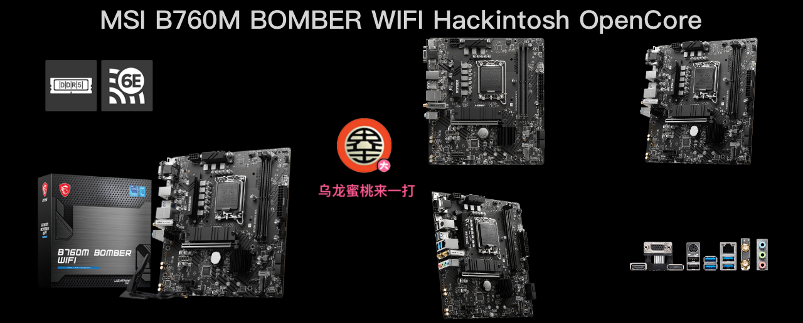
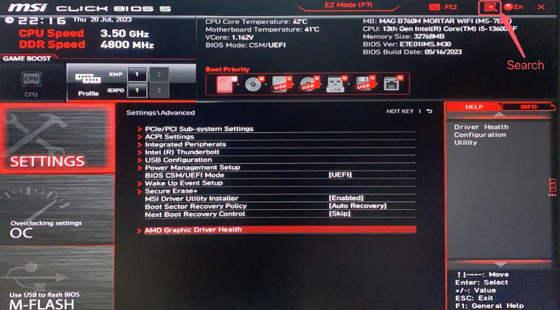

## MAG B760M BOMBER WIFI Hackintosh OpenCore EFI



### [简体中文](README.zh_CN.md)


### OpenCore

[OpenCore 0.9.3](https://github.com/acidanthera/OpenCorePkg)


### macOS

- Ventura
- Monterey


### Spec

- Chipset: B760
- BIOS: 7E01vM3 2023-05-19
- CPU: Intel 12th i5-12400
- Memo: KingBank A-Die 16GB DDR5 6000 Mhz
- SSD: Lexar  NM610 Pro 1TB Windows
- SSD: TiPlus 7100 1TB MacOS
- GPU: YESTON Radeon RX 6600 8GB GDDR5
- HDA: Realtek ALC897
- LAN: Realtek RTL8125 Gaming  2.5GbE
- WLAN: Intel  AX211
- CPU COOLING: JONSBO CR1400
- CASE:  HTKC 100 Plus
- PSU:  Great Wall v7 700W ATX 80 Gold


### BIOS

```
Settings
  |-- Security
     |-- Secure Boot
       |-- Secure Boot: Disabled
       
Search
  |-- D.T.M
    |-- D.T.M: Enabled
```




### Notes

 - Use [OpenCore Configurator](https://mackie100projects.altervista.org/opencore-configurator/) or [OCAuxiliaryTools](https://github.com/ic005k/OCAuxiliaryTools) build your SMBIOS

### Screenshot


### Tools

- [Hackintool](https://github.com/headkaze/Hackintool) 
- [OCAuxiliaryTools](https://github.com/ic005k/OCAuxiliaryTools) AKA `OCAT`.
- [OpenCore Configurator](https://mackie100projects.altervista.org/opencore-configurator/) AKA `OCC`.
- [gibMacOS](https://github.com/corpnewt/gibMacOS) Build your own MacOS image.
- [ProperTree](https://github.com/corpnewt/ProperTree) Plist editor.


### Contact Us

QQ Group: 23304408


